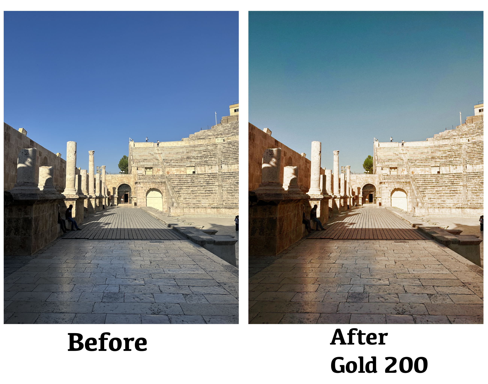
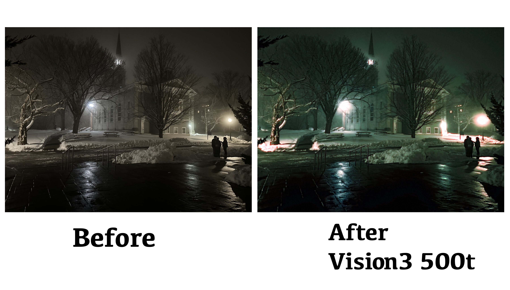

# 📷 Grainy AI

Transform your iPhone photos to look like classic film stocks using AI-powered CycleGAN models.

🚀 **[Try the Live Demo on Hugging Face](https://huggingface.co/spaces/yahyarahhawi/grainy-ai)**

## ✨ Features

- 🎬 **4 Film Stocks**: Kodak Portra 400, Gold 200, Ektar 100, and Vision 3 500T
- 📱 **iPhone Optimized**: Handles HEIC files and preserves EXIF data
- 🔧 **Multiple Interfaces**: Command-line tool, web app, and Python API
- ⚡ **GPU Accelerated**: CUDA, MPS (Apple Silicon), and CPU support
- 🎨 **Customizable**: Adjustable transformation strength and film grain
- 📦 **Easy Install**: Single command installation

## 📸 Results







*More examples available in [`examples/readme/`](examples/readme/)*

## 🚀 Quick Start

### Installation

```bash
# Clone the repository
git clone https://github.com/yahyarahhawi/grainy-ai.git
cd grainy-ai

# Install dependencies
pip install -r examples/requirements.txt
```

### 📦 Download Model Weights

**Required**: Download the trained models before using Grainy AI.

1. **Download**: [Model Weights on Google Drive](https://drive.google.com/drive/folders/1sYGHKPkY6rAe16yiiHMzpaCw_ITzQ-bw?usp=sharing)
2. **Extract**: Place the `weights/` folder in the project root directory
3. **Structure**: Your project should look like:
   ```
   grainy-ai/
   ├── weights/
   │   ├── Vision 3 500T/
   │   ├── Gold 200/
   │   ├── Ektar 100/
   │   └── Portra 400/
   ├── src/
   └── apps/
   ```

### Command Line Usage

```bash
# Basic usage
python apps/cli/film_cli.py photo.jpg --style portra400

# Process iPhone HEIC files
python apps/cli/film_cli.py IMG_1234.HEIC --style gold200 --output vintage_photo.jpg

# Batch process entire photo library
python apps/cli/film_cli.py photos/ --style vision3500t --batch

# Add film grain and adjust strength
python apps/cli/film_cli.py photo.jpg --style ektar100 --strength 0.8 --grain medium
```

### Web Interface

**Option 1: Use the Online Demo**
🌐 **[Try Grainy AI on Hugging Face](https://huggingface.co/spaces/yahyarahhawi/grainy-ai)** - No installation required!

**Option 2: Run Locally**
```bash
cd apps/web
pip install gradio
python app.py
```

Open http://localhost:7860 in your browser.

### Python API

```python
from src.film_emulator import FilmEmulator

# Initialize emulator
emulator = FilmEmulator(device="auto")  # auto-detects best device

# Transform single image
result = emulator.transform(
    "photo.jpg",
    film_stock="portra400",
    strength=0.9
)

# Save result
from PIL import Image
Image.fromarray(result).save("film_photo.jpg")
```

## 🧠 How It Works

This system uses **CycleGAN** (Cycle-Consistent Generative Adversarial Networks) to learn the mapping between iPhone photos and film aesthetics without requiring paired training data.

### Training Process

1. **Unpaired Dataset Collection**: Two separate distributions of images:
   - **Domain A**: iPhone digital photos (modern, clean, high dynamic range)
   - **Domain B**: Scanned film photographs (grain, color characteristics, film response curves)

2. **CycleGAN Architecture**: 
   - **Generator A→B**: Transforms iPhone photos to film style
   - **Generator B→A**: Transforms film photos to digital style (for cycle consistency)
   - **Discriminators**: Distinguish between real and generated images in each domain

3. **Loss Functions**:
   - **Adversarial Loss**: Makes generated images indistinguishable from real ones
   - **Cycle Consistency Loss**: Ensures A→B→A returns to original image
   - **Identity Loss**: Preserves color composition when input is already target style

4. **Training Data Requirements**:
   - No pixel-level correspondence needed between iPhone and film images
   - Learns style transfer through statistical distributions of each domain
   - Typically requires 1000+ images per domain for good results

### Model Architecture
- **Generator**: ResNet-based (9 or 15 residual blocks)
- **Discriminator**: PatchGAN (focuses on local image patches)
- **Input/Output**: 256×256 RGB images (upscaled for inference)

## 🎬 Supported Film Stocks

| Film Stock | Best For | Style |
|------------|----------|-------|
| **Kodak Portra 400** | Portraits, people | Natural skin tones, warm colors |
| **Kodak Gold 200** | Everyday photos | Warm, nostalgic look |
| **Kodak Ektar 100** | Landscapes, nature | Vibrant, saturated colors |
| **Vision 3 500T** | Night photography | Tungsten-balanced, cinematic |

## 📁 Project Structure

```
grainy-ai/
├── src/                    # Core functionality
│   ├── film_emulator.py   # Main API
│   ├── models/            # CycleGAN models
│   ├── data/              # Dataset utilities
│   ├── utils/             # Helper functions
│   └── options/           # Configuration
├── apps/
│   ├── cli/               # Command-line interface
│   └── web/               # Gradio web app
├── weights/               # Pre-trained model weights (download separately)
├── examples/              # Jupyter notebooks and examples
└── grainy-ai/             # Hugging Face deployment (separate repo)
```

## ⚙️ Advanced Usage

### Custom Model Weights

```bash
# Use custom trained weights
python apps/cli/film_cli.py photo.jpg --style portra400 --weights path/to/custom.pth
```

### Device Selection

```bash
# Force specific device
python apps/cli/film_cli.py photo.jpg --style gold200 --device cuda
python apps/cli/film_cli.py photo.jpg --style gold200 --device mps  # Apple Silicon
python apps/cli/film_cli.py photo.jpg --style gold200 --device cpu
```

### High-Resolution Processing

```bash
# Process at 4K resolution
python apps/cli/film_cli.py photo.jpg --style ektar100 --resolution 4096
```

## 🔧 Development

### Training New Models

```bash
# Use the original CycleGAN training script
cd scripts
python ../pytorch-CycleGAN-and-pix2pix/train.py \
    --dataroot ./datasets/your_dataset \
    --name your_film_stock \
    --model cycle_gan
```

### Running Tests

```bash
pip install pytest
pytest tests/
```

### Code Formatting

```bash
pip install black flake8
black .
flake8 .
```

## 📋 Requirements

- Python 3.8+
- PyTorch 1.4+
- 4GB+ RAM (8GB+ recommended)
- GPU with 4GB+ VRAM (optional but recommended)

## 🤝 Contributing

1. Fork the repository
2. Create a feature branch (`git checkout -b feature/amazing-feature`)
3. Commit your changes (`git commit -m 'Add amazing feature'`)
4. Push to the branch (`git push origin feature/amazing-feature`)
5. Open a Pull Request

## 📄 License

This project is licensed under the MIT License with Commercial Use Restriction - see the [LICENSE](LICENSE) file for details.

**⚠️ Commercial Use Notice**: Any commercial use of this software requires explicit written approval from the author. For commercial licensing inquiries, please contact [yahyarahhawi@gmail.com].

## 🙏 Acknowledgments

- Original CycleGAN implementation by [Jun-Yan Zhu](https://github.com/junyanz/pytorch-CycleGAN-and-pix2pix)
- Film stock training data from various photography communities
- Inspiration from analog photography enthusiasts

## 📚 Citation

If you use this project in your research, please cite:

```bibtex
@software{grainy_ai,
  title={Grainy AI: AI-Powered Film Stock Simulation},
  author={Yahya Rahhawi},
  year={2024},
  url={https://github.com/yahyarahhawi/grainy-ai}
}
```

---

*Transform your digital memories into timeless film aesthetics* ✨